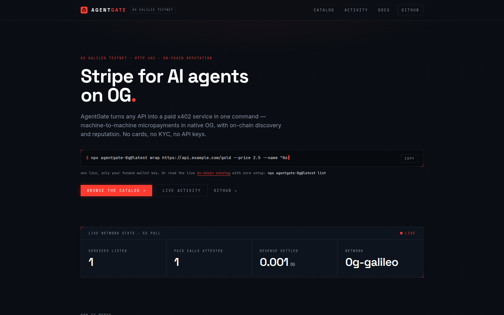
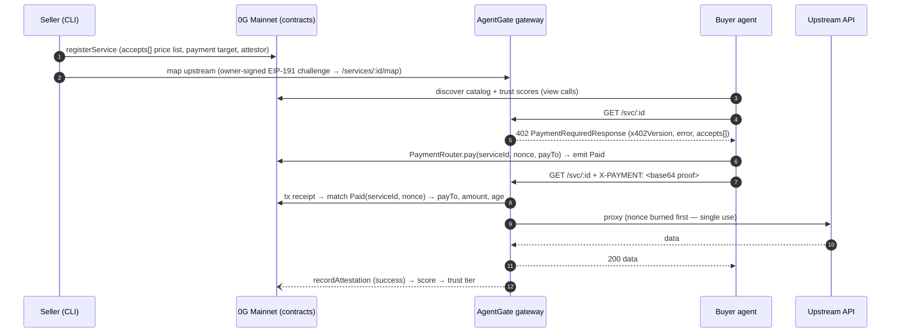

<div align="center">

# AgentGate

### Stripe for AI agents on 0G

**Turn any HTTP API into a paid, on-chain service in one command — HTTP 402 micropayments in native OG, with an on-chain registry and payment-backed reputation.**

[](https://github.com/agentgate-0g/0g-gate/actions/workflows/ci.yml)
[](https://www.npmjs.com/package/agentgate-0g)
[](LICENSE)
[](https://chainscan.0g.ai/address/0x48144BF9d966789bf4Db4e84349d4F4878a4b7Da)
[](https://chainscan-galileo.0g.ai/address/0xDB3C29a09FdDe79828208603B743E769E9f6dBEe)

**[Dashboard](https://agentgate.equiflow.xyz)** · **[Gateway](https://0g-gateway.equiflow.xyz)** · **[npm](https://www.npmjs.com/package/agentgate-0g)** · **[Docs](https://agentgate.equiflow.xyz/docs)** · **[Explorer](https://chainscan.0g.ai)** · **[Testnet faucet](https://faucet.0g.ai)**

**Live on 0G Mainnet** since 2026-09-15 — the hosted gateway, the dashboard and the published CLI (`agentgate-0g@2.0.0`) all default to the mainnet contract set; the Galileo testnet set stays one variable away (`ZG_NETWORK_PROFILE=galileo`).

[](https://agentgate.equiflow.xyz)

</div>

---

## Contents

- [What is AgentGate](#what-is-agentgate)
- [Try it in 30 seconds](#try-it-in-30-seconds)
- [The one-liners](#the-one-liners)
- [How it works](#how-it-works)
- [Quickstart (offline)](#quickstart-offline)
- [Configuration and modes](#configuration-and-modes)
- [Repository layout](#repository-layout)
- [Scripts and tests](#scripts-and-tests)
- [Deployed addresses](#deployed-addresses)
- [Deployment and hosting](#deployment-and-hosting)
- [Roadmap](#roadmap)
- [About](#about)

---

## What is AgentGate

AI agents can't pay for the APIs they use — no cards, no logins, no accounts. AgentGate is the payment layer that fixes this on 0G: a seller wraps an API in one command, a buyer agent discovers and pays it in one command, and every paid call leaves a verifiable on-chain receipt.

- **One-command wrap** — any HTTP API becomes a paid, on-chain-registered service; the private upstream never touches the chain.
- **One-command buy** — discover from the on-chain registry, pay a machine-readable 402 invoice, get the data back.
- **Invoice-bound payments** — the buyer pays through a `PaymentRouter` contract that binds the invoice nonce to the payment **on-chain** and rejects a replay, so verification is one exact-match log lookup instead of a heuristic transfer search.
- **On-chain price list** — each service stores an `accepts[]` price list *in the contract*, with a per-entry `asset` address and EIP-712 domain fields. The shipped rail is **native OG only** (`PaymentRouter.pay()` settles `msg.value`); the multi-asset shape is already on-chain, so an authorization-settled ERC-20 rail is a client change, not a contract change.
- **Native MCP tools** — one line of config and any MCP-capable agent (Claude Desktop, custom clients) gets discover / inspect / pay as native tools.
- **Payment-backed reputation** — every arms-length served call is attested on-chain, so trust scores are receipts of real value transfer, not marketing. Every point has to map to a settlement that paid *this* service *its* listed price at *its* registered payout address, and a call paid by the service's own owner, payout account or attestor is served but never scored. Read that as what it is: it makes a score impossible to mint without a real payment, and it closes the free self-pay loop. It does **not** stop a seller who cycles its own funds through a fresh address — that pays the money to itself and costs only gas. Staking-weighted attestations with slashing (roadmap) are what would put a real price on it.
- **Zero-config reads, no API key at all** — `list` and `status` are plain public-RPC reads: view calls, plus one bounded `eth_getLogs` for attestation history. There is no indexer and no key to provision, anywhere in the read path.

---

## Try it in 30 seconds

Requires Node ≥ 22. No keys, no network, no chain access — the whole loop runs in-process against a mock chain:

```bash
npm install
npm run demo     # register → 402 → pay → serve → attest → score, exits 0
```

It boots a mock chain + oracle + gateway in-process, wraps the oracle at 0.5 OG, runs the LLM buyer agent (deterministic MockLlm — no API key needed), and prints the **payment tx hash**, the **attestation tx hash**, and the final score.

Against the live 0G Mainnet deployment ([addresses](#deployed-addresses)):

```bash
npx agentgate-0g@latest list                # the on-chain service catalog, zero setup
curl -sS https://0g-gateway.equiflow.xyz/svc/3    # a real HTTP 402 invoice from the live gateway
```

The mainnet catalog currently lists six services (ids 1–6: FX rates, crypto spot prices, the Fear & Greed index, Jakarta weather and air quality, Bitcoin fee estimates) priced at 0.0005–0.002 OG per call, every one with a real settled payment and attestation behind its score.

<details>
<summary><b>For judges / reviewers — drive the live MCP server in one paste</b></summary>

<br>

The CLI defaults to **live 0G Mainnet** + the deployed registry (from `agentgate-0g@2.0.0`; 1.x targets the first Galileo set), and every read tool is a public-RPC view call — no `.env`, no API key, no clone. From any directory:

```bash
( printf '%s\n' \
  '{"jsonrpc":"2.0","id":1,"method":"initialize","params":{"protocolVersion":"2025-06-18","capabilities":{},"clientInfo":{"name":"judge","version":"0.0.0"}}}' \
  '{"jsonrpc":"2.0","method":"notifications/initialized"}' \
  '{"jsonrpc":"2.0","id":2,"method":"tools/call","params":{"name":"agentgate_list_services","arguments":{}}}' ; \
  sleep 8 ) | npx -y agentgate-0g@latest mcp 2>/dev/null \
  | jq -r 'select(.id==2) | .result.content[0].text | fromjson'
```

Cloned the repo? `scripts/mcp.sh` wraps the same handshake:

```bash
scripts/mcp.sh list
scripts/mcp.sh invoice 1     # a real HTTP 402 invoice; the nonce changes each call
```

Only `agentgate_buy` needs a funded buyer key — every read tool is zero-setup.

</details>

---

## The one-liners

**Sell** — wrap any HTTP API into a paid service. Registers on-chain (signed by your key) and maps your upstream on the gateway via an owner-signed EIP-191 challenge (no shared admin token):

```bash
export SELLER_SIGNER_KEY=0x…   # holds OG on 0G Mainnet (a registration costs well under 0.01 OG in gas)
npx agentgate-0g wrap https://api.example.com/data --price 2.5 --name "My Data API"
```

> Rehearse for free first: `ZG_NETWORK_PROFILE=galileo` selects the testnet set, [faucet.0g.ai](https://faucet.0g.ai) funds the key (0.1 OG per wallet per day), and `--gateway https://0g-gateway.mdloglabs.org` maps the upstream on the Galileo gateway.

**Buy** — pay one call to any listed service. The CLI pays the 402 invoice through `PaymentRouter.pay(serviceId, nonce, payTo)` and prints the data — body to stdout, payment receipt to stderr:

```bash
export BUYER_SIGNER_KEY=0x…
npx agentgate-0g buy 3 --max 5
```

> Any id `list` shows as **ACTIVE** works (all six mainnet services are). A paused service fails
> fast with `SERVICE_INACTIVE`, and an invoice above `--max` with `PRICE_EXCEEDED`, before a single
> wei moves.

> `--key` is accepted as a flag on both, but it carries the private key itself — it lands in shell history and `ps`. The env vars above are the documented path.

**Hand it to an agent** — one command exposes the whole loop to any MCP-capable client as native tools:

```bash
npx agentgate-0g mcp          # a Model Context Protocol stdio server
```

Tools: `agentgate_list_services`, `agentgate_get_service`, `agentgate_get_invoice` (read-only, no key) and `agentgate_buy` (pays a 402 invoice from the buyer key, capped by `maxOg`). Wire it into Claude Desktop's `claude_desktop_config.json`:

```json
{ "mcpServers": { "agentgate": { "command": "npx", "args": ["-y", "agentgate-0g", "mcp"] } } }
```

---

## How it works

Sellers put a **402 paywall** in front of their API and register it in an on-chain registry with an **`accepts[]` price list**. Buyer agents discover services from the registry and pay by calling **`PaymentRouter.pay(serviceId, nonce, payTo)`** with the invoice price as `msg.value` — the router forwards the value straight to the seller and emits a `Paid` event with `serviceId` and `nonce` **indexed**. The buyer retries with the transaction hash, and the gateway verifies the payment by reading that transaction's receipt and matching its `Paid` logs — one exact lookup, no scanning and no indexer — before proxying the call and recording an **on-chain attestation** that feeds the service's trust score. No accounts, no API keys, no subscriptions: HTTP 402 + 0G.



The nonce is burned twice over: `PaymentRouter` rejects a repeated `(serviceId, nonce)` on-chain, and the gateway's invoice store burns it before proxying. Either alone stops a replay; together they close the gap between them.

### Where this sits relative to x402

AgentGate speaks the **x402 V1 envelope** — HTTP `402`, `accepts[]` / `PaymentRequirements`, the `X-PAYMENT` and `X-PAYMENT-RESPONSE` headers — so anything that parses an x402 challenge can read one of ours.

It does **not** implement x402's `exact` settlement scheme, and says so on the wire: the scheme is named **`exact-settled`**. The difference is the direction of settlement.

| | x402 `exact` | AgentGate `exact-settled` |
|---|---|---|
| Payer sends | a signed authorization (EIP-3009), not yet moved | a tx hash of a payment that **already settled** |
| Who settles | the resource server, or a facilitator for it | the **buyer**, before presenting proof |
| Facilitator | a `/verify` + `/settle` service | **none** |

0G has no x402 facilitator, so settled-proof is the rail that can actually ship there — no third party in the money path, and the gateway custodies nothing. Advertising `scheme:"exact"` would promise an interop we cannot honour: a generic x402 client would sign an authorization and be 402'd forever. The distinct name makes it fail fast instead. The on-chain `accepts[]` price list is the seam where an authorization-based rail could be added later without touching the contracts.

> Full component breakdown: [docs/ARCHITECTURE.md](docs/ARCHITECTURE.md) · engineering contract: [docs/SPEC.md](docs/SPEC.md) · protocol detail: [/docs/protocol](https://agentgate.equiflow.xyz/docs/protocol#x402-relationship).

---

## Quickstart (offline)

### See it in the dashboard

```bash
npm run dev:seed          # boots devnet+oracle+middleware AND seeds one wrapped
                          # service + a real paid call, then STAYS UP
npm run dev:dashboard     # in a second terminal → open the URL it prints
```

### Manual dev loop

```bash
npm run dev               # empty stack: devnet :4030 + oracle :4010 + middleware :4021
# paste the printed MOCK_BUYER_ACCOUNT / MOCK_SELLER_ACCOUNT export lines, then:
npm run agentgate -- wrap http://localhost:4010/feed --mode mock --price 0.5 --name "RWA FX & Gold Oracle"
npm run agent -- --task "Get today's USD/IDR rate and gold price, summarize for a treasury report"
npm run agentgate -- buy 1 --mode mock    # or skip the agent: pay once, print the data
```

Set `ANTHROPIC_API_KEY` to let the buyer agent use Claude instead of the MockLlm.

<details>
<summary><b>Port notes and gotchas</b></summary>

<br>

- **Demo ports:** the demo binds `:4030` (devnet), `:4010` (oracle) and `:4021` (gateway). If one is taken (`EADDRINUSE`), override: `DEVNET_PORT=14030 ORACLE_PORT=14010 MIDDLEWARE_PORT=14021 npm run demo`.
- **`npm run demo` won't show in the dashboard** — it boots its *own* in-memory chain, runs the loop, and exits, so its data is gone by the time you open a browser. Use `npm run dev:seed` (persistent + populated) to view it live. The dashboard polls the running stack every 5 s.
- **Dashboard port:** defaults to `http://localhost:3000`, but if 3000 is taken Next.js silently moves to **3001** (or the next free port). Always open the URL printed in the `dev:dashboard` terminal.

</details>

---

## Configuration and modes

`AGENTGATE_MODE=mock|live` (default `mock` for the repo stack; the published CLI defaults to `live`) selects the chain backend behind the `ChainClient` seam — everything above it is identical. In live mode, `ZG_NETWORK_PROFILE=mainnet|galileo` (default `mainnet`) selects the whole chain identity as one unit — RPC, chain id, network name, explorer, the three contract addresses and their deploy block:

| | `mock` | `live` (0G Mainnet by default) |
|---|---|---|
| Chain | in-memory devnet (`@agentgate/devnet`) | viem against the public 0G RPC |
| Signers | mock account strings | `0x`-prefixed 32-byte private keys |
| Payment verify | devnet transfer lookup | tx receipt → `Paid(serviceId, nonce)` log |
| Registry | devnet mirrors the contract rules | deployed `AgentGateRegistry` |
| Reads | in-memory | contract view calls — no indexer, no API key |
| Guardrails | default admin token OK, SSRF guard off | default token refused, SSRF guard on |

All gateway, CLI, oracle and agent env vars are documented in [.env.example](.env.example) — the dashboard has one build-time var of its own, `NEXT_PUBLIC_SITE_URL`. In **live mode** the gateway requires `GATE_SIGNER_KEY` and a non-default `AGENTGATE_ADMIN_TOKEN`, both refused at boot if missing or left at the default. `REGISTRY_CONTRACT_ADDRESS` and `PAYMENT_ROUTER_ADDRESS` are **optional**: left unset they are the selected profile's [deployed addresses](#deployed-addresses), so set them (with `CONTRACTS_DEPLOY_BLOCK`) only to point at a deployment of your own — a malformed value is refused at boot, and the live client checks the RPC's chain id and the contracts' ABI shape before serving anything. The **CLI is looser**: `list` and `status` — attestation history included — read the public RPC with no keys at all. Live `wrap` needs **no** admin token: it maps the upstream by signing an ownership challenge with `SELLER_SIGNER_KEY`, verified against the on-chain `owner`. Live `buy` needs only a funded `BUYER_SIGNER_KEY`. Flags override env everywhere (flag > env > default): `--mode`, `--rpc-url` and `--registry` on every command, `--key` on `wrap`, `map`, `buy`, `pause`, `resume` and `mcp`, `--gateway` on `wrap`, `map` and `buy`, and `--admin-token` on `wrap` and `map`.

> **Key hygiene.** Signer keys are raw hex in environment variables. An env var leaks through `docker inspect`, `/proc/<pid>/environ`, platform dashboards and crash dumps in ways a mode-600 file does not — see [docs/DEPLOY-GATEWAY.md](docs/DEPLOY-GATEWAY.md) for the operator hardening steps. The code never logs a key, and a malformed one is reported by variable name, never by value.

---

## Repository layout

```
packages/
  shared/        types · config · bigint money · trust tiers (zero runtime deps)
  devnet/        in-memory mock chain HTTP server                         :4030
  chain/         ChainClient: MockChainHttpClient + Live0gClient (viem)
  middleware/    the product core — 402 paywall proxy + owner-signed self-map   :4021
  client/        agent-side fetchPaid (parse 402 → pay via router → retry)
  oracle/        demo RWA feed: USD/IDR + gold spot + confidence          :4010
  buyer-agent/   LLM decision loop (AnthropicLlm / MockLlm)
  cli/           agentgate wrap | map | buy | list | status | pause | resume | demo-accounts | mcp
dashboard/       Next.js 16 landing + catalog + live activity + docs      :3000
contracts-evm/   AgentGateRegistry · PaymentRouter · SpendGuard (Solidity + Foundry)
e2e/             full-loop test, in-process servers on port 0
scripts/         dev.ts (mock stack) · live.ts (live gateway) · demo.ts · mcp.sh · smoke-live-read.ts
docs/            ARCHITECTURE · SPEC · DEPLOY · DEPLOY-GATEWAY · HOSTING · TESTING (+ archive/)
deploy/          pm2 ecosystem config + systemd unit for the hosted gateway
.github/         CI workflow (the badge above) + issue and PR templates
```

---

## Scripts and tests

| Command | What it does |
|---|---|
| `npm run demo` | one-shot full loop, offline, exits 0 with both tx hashes |
| `npm run dev` | boots devnet + oracle + middleware, seeds demo accounts |
| `npm run dev:dashboard` | Next.js dashboard at :3000 |
| `npm run agentgate -- …` | the `agentgate` CLI |
| `npm run agent -- --task "…"` | run the buyer agent once |
| `npm run typecheck` | `tsc --noEmit` in every package + dashboard + root scripts/e2e |
| `npm test` | vitest: all package units + the e2e loop (598 tests) |
| `npm run build` | dashboard `next build` |

Contract tests: `cd contracts-evm && forge test` — 143 tests across nine suites: `AgentGateRegistry` (71), `SpendGuard` (37), `Boundaries` (17), `PaymentRouter` (9), `DeployScript` (4), `SybilReputation` (2), `GasCoupling` (1) and two stateful invariants (registry score ledger, SpendGuard solvency). `contracts-evm/lib/` is gitignored and there are no submodules, so a fresh clone vendors forge-std once first: `forge install foundry-rs/forge-std@v1.16.2 --no-git --shallow`. CI does the same, pinned to the same tag.

> `packages/chain`'s live-client suites spawn a real `anvil` and deploy the contracts to it, so [Foundry](https://getfoundry.sh) is required for a full `npm test` run — without it those suites fail rather than skip. CI installs it.

---

## Deployed addresses

The same contract set is deployed on both 0G networks — byte-identical bytecode, verified source on both explorers, recorded in `packages/shared/src/config.ts` by `scripts/set-deployment.ts` after on-chain verification. `ZG_NETWORK_PROFILE` selects the network — `mainnet` is the default since 2026-09-15, `galileo` keeps the testnet set; see [Configuration](#configuration-and-modes).

**0G Mainnet** (default) — chain ID `16661`, RPC `https://evmrpc.0g.ai`, explorer [chainscan.0g.ai](https://chainscan.0g.ai), native token **OG** (18 decimals).

> **Deployed 2026-09-15**, blocks 44406357–44406358, by the same deployer wallet as Galileo. Total deploy cost **0.0196 OG** (4,900,008 gas at 4 gwei). Source verified on chainscan.0g.ai for all three. Wired in as the CLI's built-in defaults — `npx agentgate-0g list` reads this registry with no configuration at all. **No external audit has been performed** on these contracts (see [contracts-evm/README.md](contracts-evm/README.md)) — size any mainnet position accordingly.

| Artifact | Address |
|---|---|
| `AgentGateRegistry` | [`0x48144BF9d966789bf4Db4e84349d4F4878a4b7Da`](https://chainscan.0g.ai/address/0x48144BF9d966789bf4Db4e84349d4F4878a4b7Da) |
| `PaymentRouter` | [`0x5102EB216b65CF950D3e88c8ddD51008de0845eF`](https://chainscan.0g.ai/address/0x5102EB216b65CF950D3e88c8ddD51008de0845eF) |
| `SpendGuard` | [`0xDfD0f8eE32Cb01015cD131d463E83e6974A9D761`](https://chainscan.0g.ai/address/0xDfD0f8eE32Cb01015cD131d463E83e6974A9D761) |

**0G Galileo Testnet** — chain ID `16602`, RPC `https://evmrpc-testnet.0g.ai`, explorer [chainscan-galileo.0g.ai](https://chainscan-galileo.0g.ai). Select it with `ZG_NETWORK_PROFILE=galileo`; its catalog is served by `https://0g-gateway.mdloglabs.org`. Faucet: [faucet.0g.ai](https://faucet.0g.ai) (0.1 OG per wallet per day).

> **Deployed 2026-09-03 09:24 UTC**, block 52865624 — all three in a single block. Total deploy cost **0.0196 OG** (4,900,008 gas at 4 gwei).

| Artifact | Address |
|---|---|
| `AgentGateRegistry` | [`0xDB3C29a09FdDe79828208603B743E769E9f6dBEe`](https://chainscan-galileo.0g.ai/address/0xDB3C29a09FdDe79828208603B743E769E9f6dBEe) |
| `PaymentRouter` | [`0xCC3bbd10eBA7aa24F4F722E00e714e1413182c34`](https://chainscan-galileo.0g.ai/address/0xCC3bbd10eBA7aa24F4F722E00e714e1413182c34) |
| `SpendGuard` | [`0xfEA4236162d7126d90D59Dc15bBb8A93b3786938`](https://chainscan-galileo.0g.ai/address/0xfEA4236162d7126d90D59Dc15bBb8A93b3786938) |

None of the six is upgradable — there is no proxy, so a redeploy is a **new address starting from empty state**. These values are a compatibility surface for every zero-config user, not a config knob.

---

## Deployment and hosting

**Currently hosted (0G Mainnet):** the gateway runs at **https://0g-gateway.equiflow.xyz** and the dashboard at **https://agentgate.equiflow.xyz** — pm2 processes behind a Cloudflare tunnel, from [`deploy/agentgate.ecosystem.config.cjs`](deploy/agentgate.ecosystem.config.cjs). The Galileo testnet catalog stays live behind its own gateway, **https://0g-gateway.mdloglabs.org**, for testing with faucet OG. The CLI is published to npm as [`agentgate-0g`](https://www.npmjs.com/package/agentgate-0g) and defaults to the mainnet gateway. One dashboard build serves both networks — every badge, explorer link and docs address is resolved per request from `ZG_NETWORK_PROFILE`.

> `gateway.mdloglabs.org` (no `0g-` prefix) is the **older Casper deployment**, kept running separately. It is a different chain with a different registry, so pointing `--gateway` at it registers a service on 0G that the gateway cannot map — the on-chain registration is real and is not rolled back, while `/svc/<id>` 404s.

> Mind the hostname: `agentgate.mdloglabs.org` (no `0g-`) is the **older Casper dashboard**, still running alongside — `/api/services` there reports `network: casper-test` and prices in CSPR. The 0G one is `agentgate.equiflow.xyz`.

<details>
<summary><b>Deploy runbook and self-hosting</b></summary>

<br>

- **Contract deploy:** [contracts-evm/README.md](contracts-evm/README.md) (the Foundry script, the faucet budget, and the Anvil-fork dry run) and [docs/DEPLOY.md](docs/DEPLOY.md) for the end-to-end procedure including post-deploy verification.
- **Gateway + dashboard runbook (what the public instance runs):** `deploy/agentgate.ecosystem.config.cjs` in [docs/DEPLOY-GATEWAY.md](docs/DEPLOY-GATEWAY.md) — one pm2 pair per network.
- **Platform hosting:** [docs/HOSTING.md](docs/HOSTING.md) — dashboard → Vercel (Root Directory `dashboard`), middleware + oracle → Railway (per-package Dockerfiles + `railway.json`), plus a self-contained `docker-compose.hosting.yml` demo stack.

</details>

---

## Roadmap

**Shipped**

- Solidity contract suite — `AgentGateRegistry`, `PaymentRouter`, `SpendGuard` (143 Foundry tests), deployed byte-identically on 0G Mainnet and Galileo
- Native OG rail — payments bound to their invoice by `PaymentRouter`, replay-rejected on-chain
- On-chain `accepts[]` price list — multi-asset shape stored in the contract
- Indexer-free chain client — viem view calls + `eth_getLogs`, no API key in the read path
- MCP server for any agent framework — `npx agentgate-0g mcp`
- Importable SDK — the same package is a library: `import { wrapService, buyService, listServices } from 'agentgate-0g'`
- CLI **v2.0.0** — defaults point at the 0G Mainnet contract set; `ZG_NETWORK_PROFILE=galileo` selects the testnet set (self-reviewed in-repo; **no external audit has been performed**)
- Hosted mainnet catalog — six live services behind the public gateway, each scored by real settled payments

**Next**

- External audit before real volume, then open seller onboarding
- ERC-20 rail over the existing on-chain `accepts[]` — authorization-settled, so a client change, not a contract change
- Wire `SpendGuard` into the request path as an on-chain spend firewall
- Staking-weighted attestations with slashing

---

## About

**License:** [MIT](LICENSE)
