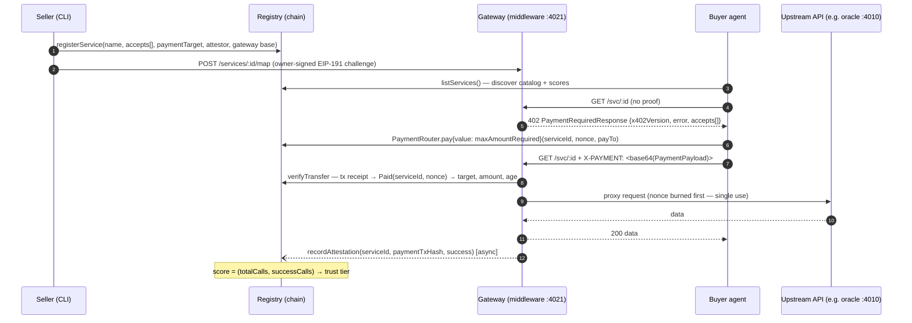

# AgentGate — Architecture

> Companion to [SPEC.md](./SPEC.md) (the authoritative engineering contract) and the
> [PRD](../AgentGate-PRD-Solo-Build-Plan.md). This file explains how the pieces fit.

## The loop

AgentGate turns any HTTP API into a paid, on-chain-registered service for AI agents:

Payment uses the **x402 V1 envelope** — but not x402's `exact` settlement scheme, and it says
so on the wire: `scheme:"exact-settled"`, `extra.settlement:"0g-payment-router"`. Where `exact`
expects a signed authorization that the server (or a facilitator) submits, this expects the buyer
to have **already settled** and to present the tx hash. 0G has no x402 facilitator, so
settled-proof is the rail that can ship there; the distinct scheme name means a generic x402
client fails fast instead of signing something this gateway will never accept.

Concretely:
a native OG payment made by calling `PaymentRouter.pay(serviceId, nonce, payTo)`, which forwards
`msg.value` straight to the seller and emits `Paid` with `serviceId` and `nonce` **indexed**. A
plain EVM value transfer carries no invoice reference, so the router is what binds a payment to
its invoice — and it rejects a repeated `(serviceId, nonce)` on-chain. The buyer broadcasts the
call themselves and presents the settled tx hash as proof in the `X-PAYMENT` header (base64-encoded
`PaymentPayload`); the gateway verifies it from the transaction receipt and responds with
`X-PAYMENT-RESPONSE` on a paid 200. The `ChainClient` seam keeps the settlement backend swappable.

## Components

```mermaid
graph LR
    subgraph agents
        BA[buyer-agent<br/>LLM loop] --> CL[client<br/>fetchPaid 402 helper]
    end
    subgraph gateway
        MW[middleware :4021<br/>402 paywall + admin API]
    end
    subgraph sellers
        CLI[cli<br/>wrap / buy / list / status] --> MW
        OR[oracle :4010<br/>USD/IDR + XAU/USD feed]
    end
    subgraph chain layer
        CH[chain<br/>ChainClient seam]
        DV[devnet :4030<br/>mock chain REST]
        CT[contracts-evm<br/>Registry · PaymentRouter · SpendGuard]
    end
    DASH[dashboard :3000<br/>Next.js landing + live views]

    CL --> MW
    MW -->|proxy| OR
    CL --> CH
    CLI --> CH
    MW --> CH
    DASH -->|/api/*| CH
    CH -->|mock| DV
    CH -->|live| CT
    SH[shared<br/>types · config · money · trust]:::shared
    classDef shared fill:#222,stroke:#888;
```

| Package | Role | Port |
|---|---|---|
| `@agentgate/shared` | types, `loadConfig()`, bigint money math, nonce, logger, trust tiers — zero runtime deps | — |
| `@agentgate/devnet` | in-memory mock chain (balances, nonce-bound transfers, registry rules, activity log) | 4030 |
| `@agentgate/chain` | `ChainClient` seam: `MockChainHttpClient` (devnet REST) / `Live0gClient` (viem view calls + `eth_getLogs`) | — |
| `@agentgate/middleware` | the product core: 402 paywall reverse proxy, invoice store, upstream map, admin API, async attestations | 4021 |
| `@agentgate/client` | agent-side `fetchPaid`: parse 402 → pay → retry with proof | — |
| `@agentgate/oracle` | demo RWA service: USD/IDR + gold spot with multi-source confidence | 4010 |
| `@agentgate/buyer-agent` | LLM decision loop (AnthropicLlm or deterministic MockLlm) | — |
| `@agentgate/cli` | `agentgate wrap|buy|list|status|pause|resume|demo-accounts` | — |
| `dashboard/` | Next.js 16 landing + catalog/detail/activity with live polling | 3000 |
| `contracts-evm/` | Solidity 0.8.28: `AgentGateRegistry` (services, scores, ring-buffered attestations), `PaymentRouter` (invoice-bound payments), `SpendGuard` (escrow spend firewall) | — |

## Mode matrix

`AGENTGATE_MODE` selects the chain backend; **everything above the `ChainClient` seam is
identical in both modes** — that is the point of the seam.

| Concern | `mock` (default) | `live` (0G Galileo Testnet) |
|---|---|---|
| Chain | `@agentgate/devnet` in-memory REST | viem against the public 0G RPC — no indexer, no API key |
| Registry | devnet mirrors the contract rules | deployed `AgentGateRegistry` (see [DEPLOY.md](./DEPLOY.md)) |
| Payment verify | devnet transfer lookup | tx receipt → `Paid(serviceId, nonce)` on `PaymentRouter` |
| Signers | mock public-key strings (`MOCK_*_ACCOUNT`) | hex private keys (`*_SIGNER_KEY`) |
| Settle delay | 0 ms | ~3000 ms default in the pay client |
| Admin token | default allowed | default **refused** by `loadConfig()` |
| SSRF guard on upstreams | off (local demos) | on (private/loopback hosts rejected) |

## Key invariants

- **Money is never floated.** All amounts are wei decimal strings, bigint-parsed
  (`@agentgate/shared/money`). 1 OG = 1e18 wei.
- **Invoices are single-use.** The nonce is burned atomically *before* proxying;
  replays get `invoice_used` even if the upstream failed. This is a deliberate
  pay-per-attempt choice: burning *after* a successful upstream call would open a
  double-spend window for concurrent requests sharing one payment. The cost is that
  an upstream failure consumes the payment — surfaced honestly as a `success=false`
  attestation that lowers the service's reputation score, which is the right
  incentive for an unreliable provider.
- **Service ids are 1-based** (`1..=servicesCount`) across the contract, devnet and
  every client; id `0` always means "absent". Attestations are returned newest-first.
- **Never charge for what we cannot deliver.** Unknown service → 404, inactive → 403,
  registered-but-unmapped → 503, all *before* an invoice is issued.
- **The upstream URL never leaks.** It exists only in the gateway's upstream map and
  admin API; proxy errors are constant strings.
- **endpointUrl is computed, never stored.** The registry stores the gateway base URL;
  every reader derives `endpointUrl = <base>/svc/<id>` (SPEC §9 final decision).
- **Attestations never block the buyer.** Recorded async after the response, one retry
  after 5 s.

## Where state lives

| State | Owner | Persistence |
|---|---|---|
| services / scores / attestations / activity | chain (devnet or contract) | devnet: process memory · live: on-chain |
| invoice nonces | middleware `InvoiceStore` | in-memory + TTL sweep (Redis-swappable seam) |
| upstream map | middleware `UpstreamStore` | `data/upstreams.json`, atomic writes |
| buyer decisions | buyer agent | `logs/decisions.jsonl` |
| feed cache | oracle | 60 s in-memory |
